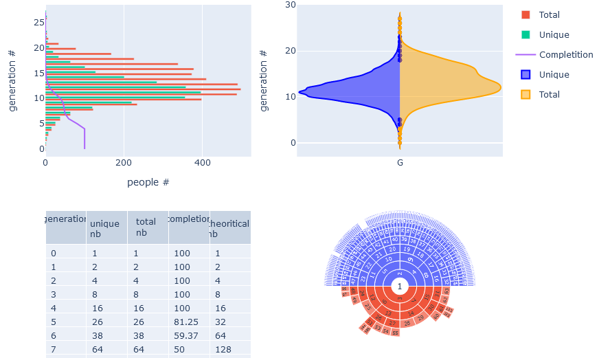
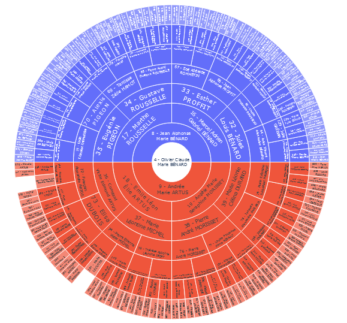
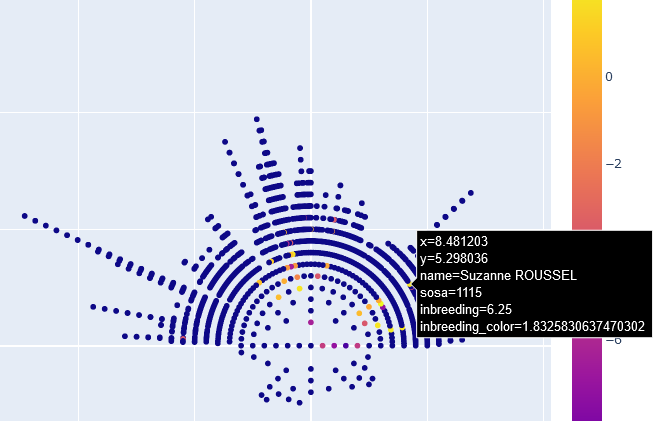

# genealogyKPI
Metrics analysis for [Geneanet](https://www.geneanet.org/) family tree based on [Sosa–Stradonitz Method Numbering](https://en.wikipedia.org/wiki/Ahnentafel).

## 1. Features

   * print ancestors as dot in scatter plot (center people is de-cujus ie sosa # 1)
   * number of people per generation #
   * implex calculation
   * inbreeding coefficient calculation for each people

## 2. Inbreeding coefficient

Inbreeding coefficient is calculated with tabular method. Picture hereafter show inbreeding value in color. Higher value is Yellow. Inbreeding 0 is dark blue.

Example with tabular method here: http://www.ihh.kvl.dk/htm/kc/popgen/genetics/4/5.htm

## 3. References

* [Plotly](https://github.com/plotly/plotly.py)

## 4. Bibliography

* Georgelis, A. (2018). Multiperspective visualization of genealogy data. https://www.diva-portal.org/smash/get/diva2:1242034/FULLTEXT01.pdf
* Ball, R., & Cook, D. (2014, February). A family-centric genealogy visualization paradigm. In Proceedings of 14th Annual Family History Technology Workshop. http://citeseerx.ist.psu.edu/viewdoc/download?doi=10.1.1.589.6435&rep=rep1&type=pdf
* Köhle, D. Spatio-Temporal Genealogy Visualization with WorldLines. https://citeseerx.ist.psu.edu/viewdoc/download?doi=10.1.1.645.7667&rep=rep1&type=pdf
* http://www.aviz.fr/geneaquilts
* Calculation of inbreeding and relationship, the tabular method http://www.ihh.kvl.dk/htm/kc/popgen/genetics/4/5.htm
* B Tier. Computing inbreeding coefficients quickly. Genetics Selection Evolution, 1990, 22 (4), pp.419-430. hal-00893856 https://hal.archives-ouvertes.fr/hal-00893856/
